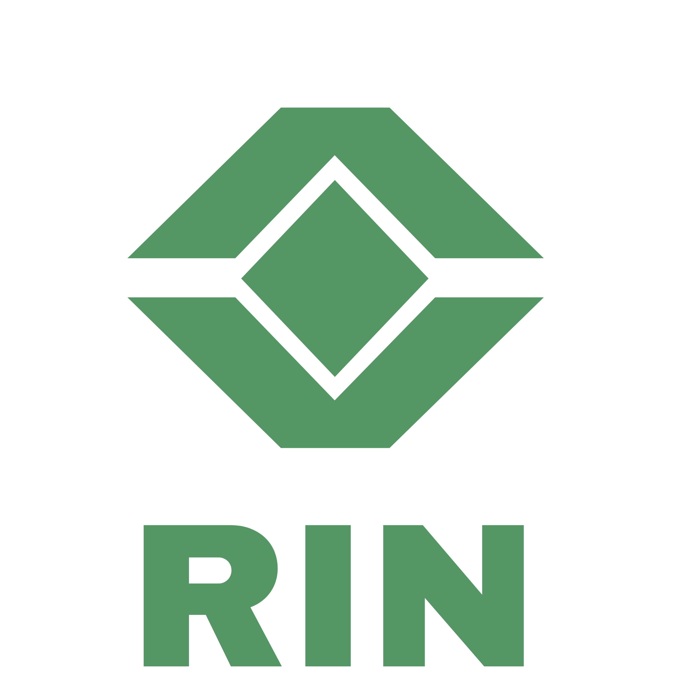
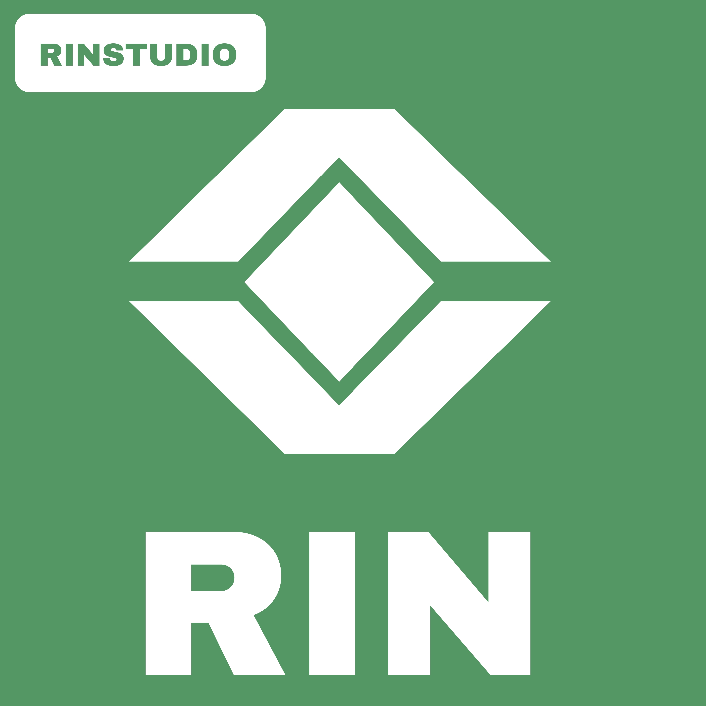

<div align="center">


<p>

<a href="#عربي">العربية</a> &nbsp;|&nbsp; <a href="#english">English</a>
</p>

</div>

<a name="عربي"></a>
<div dir="rtl">

<div align="center">


# RinLang

<p>


</p>
</div>

**لغة برمجة مُفسَّرة بمحرّك C++17 واحد — نفس المحرّك يعمل داخل تطبيق أندرويد، من سطر الأوامر، كمكتبة مضمَّنة في لغات أخرى، وحتى داخل المتصفح عبر WebAssembly.**

RinLang لغة بصياغة مألوفة (متغيرات، شروط، حلقات، دوال، مصفوفات وقواميس)، مبنية فوق مفسِّر واحد (`rin_lexer` → `rin_parser` → `rin_interpreter`) بلا أي نسخة مكرَّرة عبر المنصّات. تتميّز بنظام **حاويات** (`@container`) موحَّد تُبنى فوقه مستندات NoSQL، خطوط أنابيب بيانات بعامل `|>`، ووحدات بناء بسياسات أمان، إضافة إلى نظام استيراد (`@import`) ومكتبة قياسية تضم أكثر من **٦٠ مكتبة** جاهزة. دعم النصوص العربية/RTL مبني في صميم كل طبقة تمرّ فيها السلاسل النصية.

```rin
fun fib(n) {
    if (n < 2) { return n; }
    return fib(n - 1) + fib(n - 2);
}
print fib(10);

@container.doc=users
    document id="u1" fields={ name: "سارة", age: 28 };
.end/container.doc

@import "lib/math.og.rin";
```

<details>
<summary> <b>الميزات الكاملة (اضغط للعرض)</b></summary>

| الميزة | الوصف |
|---|---|
| بنية أساسية مألوفة | متغيرات، شروط، حلقات، دوال، مصفوفات وقواميس |
| `@container` | حاويات موحَّدة: بيانات، مستندات NoSQL (`@container.doc`)، خطوط أنابيب (`@container.pipe`)، وحدات بناء (`@make`) بسياسات أمان |
| `@import` | استيراد ملفات `.rin`/`.og.rin` مباشرة أو كحاوية باسم مستعار |
| ٦٠+ مكتبة مدمجة | رياضيات، فيزياء، سلاسل نصية، JSON/CSV، شبكات، تحقق من المدخلات، وغيرها |
| دعم عربي/RTL أصيل | تحويل صحيح بين إزاحات UTF‑16 وUTF‑8 في كل مكان يمرّ فيه نص عربي عبر JNI |
| صناعة لغات مخصّصة | عبر `langkit.og.rin` يمكن تعريف قواعد نحوية جديدة فوق نفس المحرّك |
| تعدّد المنصّات | Android · Linux · macOS · Windows · Web (WASM) — نفس المحرّك بلا تكرار |

</details>

<details>
<summary> <b>قائمة المكتبات المدمجة — ٦٠+ (اضغط للعرض)</b></summary>

`math` · `physics` · `strings` · `collections` · `functional` · `data` · `jsonkit` · `csv` · `httpkit` · `validate` · `syskit` · `requirekit` · `config` · `logger` · `colors` · `geometry` · `matrix` · `graph` · `animation` · `layout` · `events` · `cachekit` · `iterkit` · `loopkit` · `format` · `envkit` · `astwalk` · `behaviorkit` · `gridkit` · `lexkit` · `maskkit` · `loopstats`

كل مكتبة تتّبع اصطلاح نتائج آمن `{ok, ...}` بدل رمي استثناءات غير متوقَّعة.

</details>

<details>
<summary> <b>تلوين الأكواد وقواعد النحو (اضغط للعرض)</b></summary>

- `syntaxes/rin.tmLanguage.json` — قواعد TextMate مبنية من الكلمات المحجوزة الحقيقية في `rin_lexer.cpp`، صالحة فوراً لأي محرر يدعم TextMate.
- `src/` (`RinLangVSSDK`) — امتداد Visual Studio جاهز (`.vsixmanifest` + VSPackage) يمنح تلوين Rin داخل Visual Studio.
- **تلوين GitHub تحديداً** يعتمد على مشروع منفصل [`github-linguist/linguist`](https://github.com/github-linguist/linguist) ويتطلب انتشاراً فعلياً واسعاً (٢٠٠٠+ ملف `.rin`) قبل قبول طلب السحب — القواعد جاهزة ومُختبَرة، لكن هذا الشرط لم يتحقق بعد.

</details>

<details>
<summary> <b>البدء السريع (اضغط للعرض)</b></summary>

**تشغيل تفاعلي عبر CLI (Linux):**
```bash
sudo apt install cmake g++      # أو dnf/pacman المكافئ
cd cli/linux && ./build.sh
./build/rin
```

**بناء المكتبة المشتركة (Python/Node/C):**
```bash
cd bindings
cmake -B build && cmake --build build
```

**أندرويد ستوديو:** افتح مجلد `app/` كمشروع Gradle عادي (يتطلب NDK وCMake).

</details>

<details>
<summary> <b>بنية المشروع (اضغط للعرض)</b></summary>

```
rinlang/
├── app/              # RinStudio — تطبيق أندرويد (Kotlin/Compose + JNI)
│   └── src/main/cpp/ # محرّك C++17: rin_lexer / rin_parser / rin_interpreter
├── cli/              # واجهات سطر أوامر مستقلة (linux/macos/windows)
├── bindings/         # C ABI + Python ctypes + Node.js ffi-napi
├── compiler/         # rinc — مترجم (transpiler) Rin→C تجريبي
├── lib/              # ٦٠+ مكتبة قياسية بصيغة .og.rin
├── examples/         # أمثلة كود Rin جاهزة للتشغيل
├── templates/        # قوالب لصناعة لغات مخصّصة فوق المحرّك
├── syntaxes/         # rin.tmLanguage.json — قواعد التلوين النحوي
├── src/              # RinLangVSSDK — امتداد Visual Studio
├── web/              # بناء WebAssembly + عرض تفاعلي على الويب
└── docs/             # توثيق شامل لكل نظام فرعي في اللغة
```

</details>

---

<div align="center">


# RinStudio

<p>


</p>

**IDE أندرويد كامل مخصَّص للغة RinLang — محرِّر أكواد، معاينة واجهات حيّة، ومُصدِّر تطبيقات مستقلة موقَّعة.**

<a href="https://github.com/dlof-lib/rinlang/releases">


</a>
</div>

<details>
<summary> <b>ميزات المحرر الكاملة (اضغط للعرض)</b></summary>

- **محرر أكواد مبني على Canvas** بأداء محسَّن — قياس مُخبَّأ للأسطر، تمرير أفقي تلقائي للمؤشر، قائمة نسخ/قص/لصق عائمة، وإكمال تلقائي يتموضع ضمن حدود الشاشة دائماً.
- **تحويل حروف عربي آمن عبر JNI** بين أعمدة UTF‑16 (Kotlin) وUTF‑8 (محرّك C++) في كل عملية تحديد/بحث/تمييز.
- **محرّك Loomtime** لمعاينة واجهات Rin حيّة أثناء الكتابة (Strand/Fabric/Dye/Warp + نظام أحداث Needle + عناصر Banner/Dialog/Overlay/روابط تشعّبية حقيقية).
- **مُصدِّر APK حقيقي**: إعادة تعبئة الحزمة، حقن الأيقونة بكل الكثافات، تعديل AndroidManifest على مستوى AXML، وتوقيع فعلي.
- **سوق امتدادات** ومدير مكتبات لاستيراد مكتبات المجتمع مباشرة داخل المشروع.

</details>

<details>
<summary> <b>وسامات جاهزة لمشاريع Rin الأخرى (اضغط للعرض)</b></summary>

```markdown


```


</details>

---

## الترخيص

هذا المشروع مرخَّص بموجب **رخصة MIT** — راجع ملف [`LICENSE`](LICENSE).

<div align="right">

<a href="#عربي"> العودة لأعلى</a> &nbsp;|&nbsp; <a href="#english">English version </a>

</div>

</div>

---
---

<a name="english"></a>

<div align="center">


# RinLang

<p>


</p>
</div>

**An interpreted programming language with one shared C++17 engine — running inside an Android app, from the command line, embedded in other languages, and even in the browser via WebAssembly.**

RinLang has a familiar C-style syntax (variables, conditionals, loops, functions, arrays and maps) built on a single interpreter (`rin_lexer` → `rin_parser` → `rin_interpreter`) with no duplicated logic across platforms. It features a unified **container system** (`@container`) that NoSQL documents, `|>`-piped data pipelines, and policy-guarded build units are all built on top of, plus an `@import` system and a standard library of **60+ ready-made libraries**. Arabic/RTL text support is built into every layer strings pass through, not bolted on.

```rin
fun fib(n) {
    if (n < 2) { return n; }
    return fib(n - 1) + fib(n - 2);
}
print fib(10);

@container.doc=users
    document id="u1" fields={ name: "Sarah", age: 28 };
.end/container.doc

@import "lib/math.og.rin";
```

<details>
<summary> <b>Full feature list (click to expand)</b></summary>

| Feature | Description |
|---|---|
| Familiar core syntax | Variables, conditionals, loops, functions, arrays and maps |
| `@container` | Unified containers: data, NoSQL documents (`@container.doc`), data pipelines (`@container.pipe`), policy-guarded build units (`@make`) |
| `@import` | Import `.rin`/`.og.rin` files directly or as an aliased container |
| 60+ bundled libraries | Math, physics, strings, JSON/CSV, networking, input validation, and more |
| Native Arabic/RTL support | Correct UTF‑16 ↔ UTF‑8 offset conversion everywhere Arabic text crosses the JNI boundary |
| Custom language authoring | `langkit.og.rin` lets you define new grammars on top of the same engine |
| Cross-platform | Android · Linux · macOS · Windows · Web (WASM) — one engine, zero duplication |

</details>

<details>
<summary> <b>Bundled libraries — 60+ (click to expand)</b></summary>

`math` · `physics` · `strings` · `collections` · `functional` · `data` · `jsonkit` · `csv` · `httpkit` · `validate` · `syskit` · `requirekit` · `config` · `logger` · `colors` · `geometry` · `matrix` · `graph` · `animation` · `layout` · `events` · `cachekit` · `iterkit` · `loopkit` · `format` · `envkit` · `astwalk` · `behaviorkit` · `gridkit` · `lexkit` · `maskkit` · `loopstats`

Every library follows the same safe-result convention `{ok, ...}` instead of throwing unexpected exceptions.

</details>

<details>
<summary> <b>Syntax highlighting & grammars (click to expand)</b></summary>

- `syntaxes/rin.tmLanguage.json` — a TextMate grammar built from the real reserved words in `rin_lexer.cpp`, ready for any TextMate-compatible editor.
- `src/` (`RinLangVSSDK`) — a ready Visual Studio extension (`.vsixmanifest` + VSPackage) giving full Rin highlighting inside Visual Studio.
- **GitHub's own highlighting** depends on the separate [`github-linguist/linguist`](https://github.com/github-linguist/linguist) project and requires wide real-world adoption (2,000+ `.rin` files) before a PR is accepted — the grammar is ready and tested, but that threshold hasn't been met yet.

</details>

<details>
<summary> <b>Quick start (click to expand)</b></summary>

**Interactive CLI (Linux):**
```bash
sudo apt install cmake g++      # or the dnf/pacman equivalent
cd cli/linux && ./build.sh
./build/rin
```

**Build the shared library (Python/Node/C):**
```bash
cd bindings
cmake -B build && cmake --build build
```

**Android Studio:** open `app/` as a regular Gradle project (requires NDK and CMake).

</details>

<details>
<summary> <b>Project structure (click to expand)</b></summary>

```
rinlang/
├── app/              # RinStudio — Android app (Kotlin/Compose + JNI)
│   └── src/main/cpp/ # C++17 engine: rin_lexer / rin_parser / rin_interpreter
├── cli/              # Standalone CLIs (linux/macos/windows)
├── bindings/         # C ABI + Python ctypes + Node.js ffi-napi
├── compiler/         # rinc — experimental Rin→C transpiler
├── lib/              # 60+ standard libraries in .og.rin format
├── examples/         # Ready-to-run Rin code samples
├── templates/        # Templates for authoring custom languages on the engine
├── syntaxes/         # rin.tmLanguage.json — syntax highlighting rules
├── src/              # RinLangVSSDK — Visual Studio extension
├── web/              # WebAssembly build + interactive web demo
└── docs/             # Full documentation for every language subsystem
```

</details>

---

<div align="center">


# RinStudio

<p>


</p>

**A full Android IDE built specifically for RinLang — code editor, live UI preview, and a signed standalone-app exporter.**

<a href="https://github.com/dlof-lib/rinlang/releases">


</a>
</div>

<details>
<summary> <b>Full editor feature list (click to expand)</b></summary>

- **Canvas-based code editor** with optimized performance — cached line-width measurement, automatic horizontal cursor scrolling, a floating cut/copy/paste action mode, and an autocomplete popup that always clamps inside the screen bounds.
- **Safe Arabic character conversion over JNI** between UTF‑16 (Kotlin) and UTF‑8 (C++ engine) columns on every select/search/highlight operation.
- **Loomtime engine** for live-previewing Rin UIs while typing (Strand/Fabric/Dye/Warp + the Needle event system + Banner/Dialog/Overlay/real hyperlink components).
- **Real APK exporter**: package repackaging, icon injection across every density, AXML-level AndroidManifest patching, and real signing.
- **Extensions marketplace** and a library manager for importing community libraries directly into a project.

</details>

<details>
<summary> <b>Ready-made badges for other Rin projects (click to expand)</b></summary>

```markdown


```


</details>

---

## License

This project is licensed under the **MIT License** — see [`LICENSE`](LICENSE) for details.

<div align="right">

<a href="#english"> Back to top</a> &nbsp;|&nbsp; <a href="#عربي">النسخة العربية </a>

</div>
