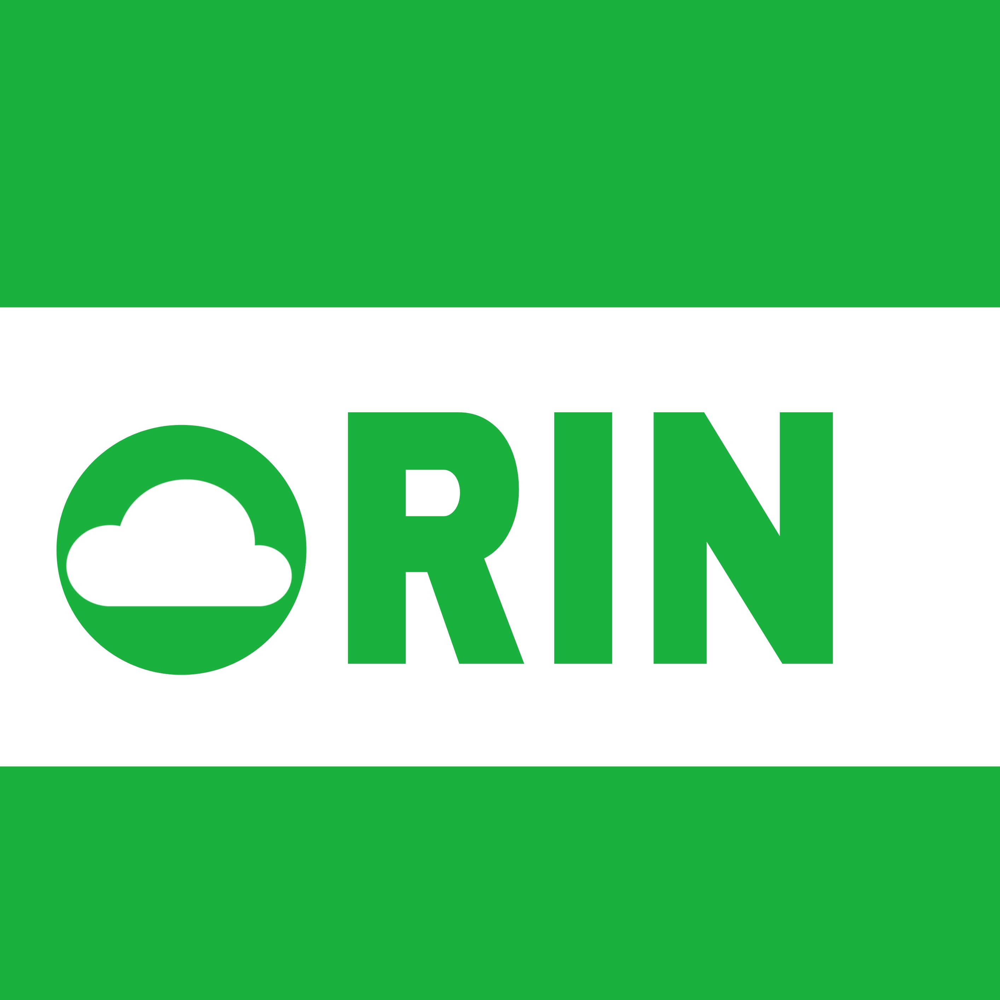

<p align="center">
  
</p>

# التعديلات المضافة على Rin

## الهوية البصرية الرسمية (Official Branding)
الصور الثلاث في `assets/branding/` هي الآن الأيقونات الرسمية للغة Rin:

| الملف | الاستخدام |
|---|---|
| `icon_bands_master.png` | الشعار العام / أيقونة إضافة VS (`src/Resources/icon.png`) / أيقونة موقع الويب (favicon) |
| `icon_green_master.png` | أيقونة تطبيق أندرويد (`ic_launcher` بكل الكثافات + الطبقة الأمامية التكيّفية) |
| `icon_black_master.png` | لافتة الشبكات الاجتماعية / بانر README (`social_preview.png`) |

تم توليد كل مقاسات أيقونات أندرويد (mdpi حتى xxxhdpi) وأيقونة الإضافة وfavicon الموقع تلقائياً من هذه الملفات الرسمية.

## الملف المعدَّل
`app/src/main/cpp/rin_interpreter.cpp`
- انسخه فوق الملف الأصلي بنفس المسار في مشروعك، ثم أعد البناء بنظامك المعتاد (Android NDK أو CLI).

### الدوال الأصلية (natives) الجديدة المُضافة (بجانب charAt تقريباً):
| الدالة | الوظيفة |
|---|---|
| chr(n) | رقم 0-255 → نص من بايت واحد |
| ord(s) | أول بايت من نص → رقمه (0-255) |
| bytesFromArray(arr) | مصفوفة أرقام → نص بايتات دفعة واحدة |
| crc32(s) | CRC-32 (نفس خوارزمية zlib/PNG/gzip) — تحقّقت: crc32("123456789") = 3421780262 ✓ |
| adler32(s) | Adler-32 (مطلوب في نهاية أي تدفق zlib) — تحقّقت: adler32("Wikipedia") = 300286872 ✓ |

## مجلد examples/ (ملفات Rin تم إنشاؤها للاختبار والإثبات)
- test_chr.rin — اختبار بسيط للدوال الجديدة
- make_png.rin — يبني ملف PNG صالح 100% من الصفر (بدون أي كود C++ خاص بـ PNG) باستخدام الدوال الجديدة فقط
- out.png — الناتج الفعلي من تشغيل make_png.rin، تم التحقق من صحته بـ Pillow (فاحص PNG حقيقي): 4×4 RGB، الألوان صحيحة


## RinOpen Object

Rin now provides a unified object/loop container:

```rin
@container.open/object=counter
    .object=text title = "Rin";

    let i = 0;

    fun greet() {
        print title;
    }

    rinopen(i < 3) {
        print i;
        i = i + 1;
    }

    for (let j = 0; j < 2; j = j + 1) {
        print j;
    }
.end/container.open/object
```

- `@container.open/object` unifies object scope with executable OOP logic.
- `.object=text` is a compact object-member declaration.
- `fun` can be used for object methods.
- `rinopen` is the new unified name for the loop concept; existing `while`/`for` remain compatible.
- `break` and `continue` continue to work inside the unified container.
