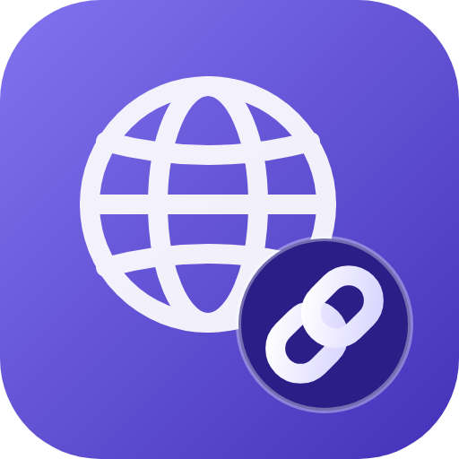

# IndsinWeb — مكتبة WebView والروابط لـ indsin



الإصدار **1.0.0** · الأيقونة: `assets/branding/indsinweb_icon.png` (512×512) و`indsinweb_icon.svg`.

`lib/indsinweb.og.rin` مكتبة مكتوبة بلغة Rin فقط (مضمَّنة في التطبيق، فلا تحتاج ملفًا على القرص):

```rin
@import "lib/indsinweb.og.rin";
```

تُجهّز كل ما يحتاجه عنصر `WebView` في indsin (`url=` / `src=` / `html=` / `ratio=`) وتتعامل مع كل أنواع الروابط
بأمان. كل الدوال تبدأ بـ `iw`، ولا تنفّذ أي JavaScript؛ كل نص يدخل في HTML يُهرَّب.

## مثال سريع

```rin
@import "lib/indsinweb.og.rin";

@container=Demo
    warp site = "youtube.com/watch?v=dQw4w9WgXcQ";

    @view.Column=Root
        padding=16;
        gap=12;

        @view.WebView=Player
            url=iwEmbedUrl(iwNormalize(site));
            ratio="16:9";
        .end/view

        @view.WebView=Card
            html=iwFragment(iwLinkHtml("مكتبات Rin", iwRinLibrary("majd", "math")), {"dir": "rtl", "padding": 12});
        .end/view
    .end/view
.end/container
```

## المرجع

| القسم | الدوال |
|---|---|
| نصوص وترميز | `iwEscape` · `iwUrlEncode` · `iwUrlEncodeKeep` · `iwUrlDecode` · `iwUrlDecodeEx(s, plus)` (UTF-8 صحيح للعربية) |
| تحليل | `iwParseUrl` (scheme, userinfo, host, port, path, query, fragment) · `iwNormalize` · `iwOrigin` · `iwScheme` · `iwHost` · `iwJoin(base, rel)` · `iwDisplay` · `iwShorten` |
| أمان | `iwIsSafe` · `iwIsSafeEx(url, schemes, allowUserinfo)` · `iwIsHttps` · `iwHostAllowed(url, hosts)` · `iwSameOrigin` · `iwSanitizeHtml` |
| استعلام | `iwQuery(map)` · `iwParseQuery` · `iwWithParams(url, map)` · `iwGetParam(url, name, default)` · `iwRemoveParam` |
| أنواع الروابط | `iwLinkKind` · `iwMailto` · `iwTel` · `iwSms` · `iwGeo` · `iwMapsUrl` · `iwWhatsApp` · `iwTelegram` · `iwPlayStore` · `iwPlayStoreWeb` · `iwAndroidIntent` · `iwDeepLink` |
| روابط Rin | `iwRinProfile(user)` · `iwRinLibrary(user, lib)` · `iwParseRinLink(url)` (القانوني والقديم `?@user/lib.og.rin`) |
| فيديو/تضمين | `iwYoutubeId` · `iwYoutubeEmbedUrl(url, opts)` · `iwYoutubeThumb` · `iwVimeoEmbedUrl` · `iwEmbedUrl` |
| HTML لـ `html=` | `iwLinkHtml` / `iwLinkHtmlEx` · `iwIframeHtml` · `iwEmbedHtml` · `iwTapButton` · `iwFragment` · `iwPage` |
| عنصر WebView | `iwRatio` · `iwHeightForRatio` · `iwWebViewAttrs(src, opts)` · `iwWebViewSource(name, src, opts)` · `iwYoutubeWebView` |
| سجل التنقّل | `iwNavNew` · `iwNavVisit` · `iwNavBack` · `iwNavForward` · `iwNavCurrent` · `iwCanBack` · `iwCanForward` · `iwNavList` |
| تنظيف وكشف | `iwStripTracking` (utm_*/fbclid/gclid...) · `iwIsPrivateHost` (localhost/10.x/192.168.x/172.16-31/169.254/IPv6 المحلي) · `iwIsPublicWeb` · `iwFileName` · `iwExtension` · `iwMediaKind` (image/video/audio/pdf/document/archive/page) |
| شريط العنوان | `iwSearchUrl(engine, q)` · `iwResolveInput(input, {engine})` → `url` / `search` / `blocked` / `empty` |
| مشاركة | `iwShareUrl(network, url, msg)`: x · facebook · linkedin · telegram · whatsapp · reddit · email · sms |
| مزوّدون | `iwSpotifyEmbedUrl` · `iwDailymotionEmbedUrl` · `iwDriveEmbedUrl` · `iwMapsEmbedUrl` · `iwIsEmbeddable` (و`iwEmbedUrl` يعرفهم جميعًا) |
| توجيه عميق | `iwRoute(url, ["open/item/:id", "/u/:name"])` → `matched` / `params` / `query` |
| روابط في النصوص | `iwExtractUrls` · `iwLinkify(text, opts)` (تهريب + روابط آمنة + `<br>`) · `iwAuditHtml(html)` (كل `href` مع النوع والأمان) |
| خطة الفتح | `iwOpenPlan(url, opts)` → `webview` / `external` / `blocked` مع السبب (`allow`, `allowPrivate`, `allowIntent`) |
| صفحات WebView | `iwCardHtml(title, desc, url, image)` · `iwErrorHtml(title, msg, {retry})` · `iwLoadingHtml` · وخيار `theme: "dark"/"light"` في `iwFragment` |
| شاشة الربط | `iwLinkScreen(url, opts)` · `iwLinkScreenAttrs` · `iwLinkScreenSource(name, url, opts)` · `iwScreenKind` · `iwLabels` (انظر أدناه) |
| المفضّلة | `iwBookmarksNew` · `iwBookmarkAdd/Remove/Has/List` · `iwBookmarksSave/Load` (JSON، يعاد فحص كل رابط عند التحميل) |

## شاشة الربط (Link Screen)

شاشة جاهزة تعرض أي رابط حسب نوعه قبل فتحه، داخل عنصر `WebView`:

```rin
@view.WebView=Screen
    html=iwLinkScreen("https://youtu.be/dQw4w9WgXcQ", {"lang": "ar", "theme": "dark"});
    height=340;
.end/view
```

| نوع الرابط | ما تعرضه الشاشة | الزر الرئيسي |
|---|---|---|
| فيديو (يوتيوب/Vimeo/Dailymotion) | صورة مصغّرة + زر تشغيل (أو مشغّل مضمَّن مع `mode: "embed"`) | تشغيل |
| صفحة ويب | النطاق + 🔒 HTTPS أو ⚠️ HTTP | فتح |
| صورة | معاينة الصورة (https فقط) | فتح |
| صوت (Spotify/ملف صوت) | بطاقة صوت | تشغيل/فتح |
| PDF / مستند / مضغوط | اسم الملف | تنزيل (أو تشغيل لمعاينة Drive) |
| بريد / هاتف / رسالة / موقع | العنوان أو الرقم | إرسال/اتصال/فتح الموقع |
| واتساب / تيليجرام / متجر / intent | "يُفتح في تطبيق آخر" | فتح في التطبيق |
| مكتبة Rin | `@user / library` | فتح |
| محجوب (`javascript:` أو محلي أو خارج `allow`) | شاشة "الرابط محجوب" بلا أي رابط | — |

الخيارات: `lang` (`en`/`ar`) · `theme` (`dark`/`light`) · `title` · `mode` (`preview`/`embed`) · `allow` · `allowPrivate` · `allowIntent`.
بلا JavaScript؛ الأزرار روابط عادية، وكل النصوص مهرَّبة.

## قواعد الأمان

- `iwIsSafe` يقبل `https`/`http` فقط افتراضيًا؛ يُرفض `javascript:` و`data:` و`file:` وأي رابط فيه مسافات أو رموز
  تحكّم (`java\nscript:`) أو `userinfo` (`https://google.com@evil.com`) أو بلا مضيف.
- `iwWebViewAttrs` يقبل أيضًا `blockPrivate: true` (يحجب العناوين المحلية/الخاصة، أي SSRF) و`stripTracking: true`.
- `iwWebViewAttrs` لا يرمي أخطاء: عند الرفض يعيد `ok=false` وسمات `html` تشرح السبب، فلا ينهار العنصر.
  الخيار `allow: ["example.com", "*.cdn.com"]` يحصر المواقع المسموحة، و`embed: true` يحوّل روابط الفيديو لروابط تضمين.
- `iwSanitizeHtml` دفاع إضافي (يحذف `script`/`iframe`/`on*=`/`javascript:`...)؛ للنص المجهول استعمل `iwEscape`.
- روابط يوتيوب تُضمَّن عبر `youtube-nocookie.com`، ويُتحقَّق من المضيف الحقيقي (`evilyoutube.com` مرفوض).

## ملاحظات عن اللغة اكتُشفت أثناء الكتابة

`text` و`style` و`to` كلمات محجوزة في Rin فلا تصلح أسماء متغيرات/معاملات؛ والنفي يُكتب `!` وليس `not`.

## مثال: متصفح مصغّر

```rin
let nav = iwNavNew();
let r = iwResolveInput(userInput, {"engine": "duckduckgo"});   // رابط أو بحث
if (r["kind"] == "url" or r["kind"] == "search") { iwNavVisit(nav, r["url"]); }
let attrs = iwWebViewAttrs(iwNavCurrent(nav), {"blockPrivate": true, "stripTracking": true, "embed": true});
// أرسل attrs["attrs"] إلى @view.WebView، أو iwWebViewSource لتوليد الكود
let plan = iwOpenPlan("mailto:a@b.co", {});                      // external → افتح تطبيق البريد
```

## الاختبار

```bash
rin tests/indsinweb_tests.rin     # 287 اختبارًا
```
